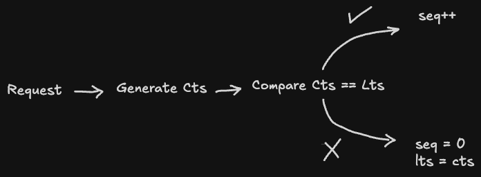

## Endpoints

POST  /generate: Generates a short URL using below implementation
[[URL Shortener Basic Idea]]
## Shortening

I was thinking take three fields, timestamps, machine ID that is generating the URL, and a sequence number, basically taking Twitter’s Snowflake IDs as inspiration

```bash title:Snowflake_ID
Timestamp --> 24 bits
Machine ID --> 4 bits, just in case two servers generate in the same millisecond
Sequence Number --> 12 bits, If one server processes mulitple requests in the same millisecond
```

### Timestamp
The timestamp is basically created by subtracting the current time with a custom epoch, in such a way it can fit numbers up to 2 ^ 24 seconds, which account for 194 days which is enough for a project of this size.

### Machine ID
For this I am just gonna assign manual worker ID’s to my docker instances through an environment variable, since I am only simulating it

### Sequence ID
Using two variables to calculate sequence, Current Timestamp (cts) and Last Timestamp (lts).  Looking at the code below, since **seq** and **lts** are mutable during requests, need synchronisation mechanism like a mutex for concurrent requests



```python title:BaseLogic
# Base Logic
cts = int(time.time()) - CUSTOM_EPOCH

if cts == lts:
	if seq == 4095:
		now = time.time()
		wait_time = 1.0 - (now % 1.0)
		time.sleep(wait_time)
		cts = int(time.time()) - CUSTOM_EPOCH
		lts = cts
		seq = 0

	else:
		seq += 1
else:
	seq = 0
	lts = cts
```

Overall I’m getting a 40 bit ID to work with once these three fields are combined
``` Timestamp << 16 | WorkerID << 12 | Sequence Number ```

### Encoding
After combination, I just **base62** encode it, instead of base64 since it doesn’t contain certain special symbols that might have different meaning in a URL like  +.